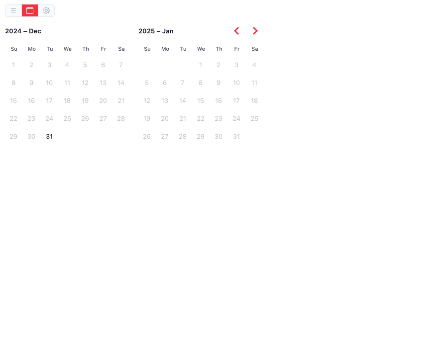
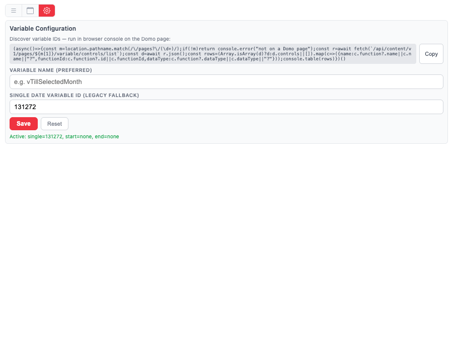
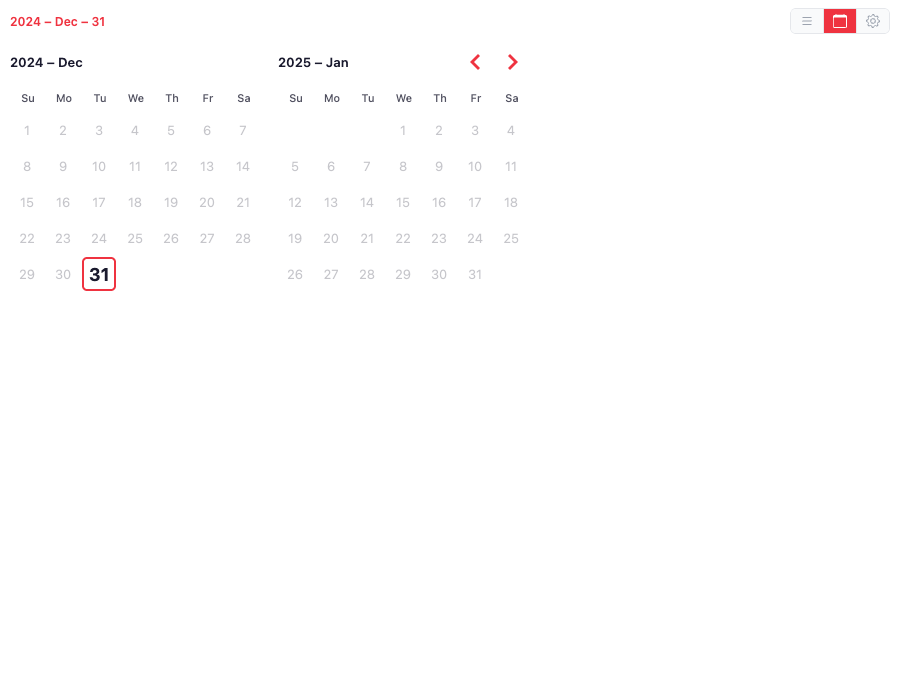
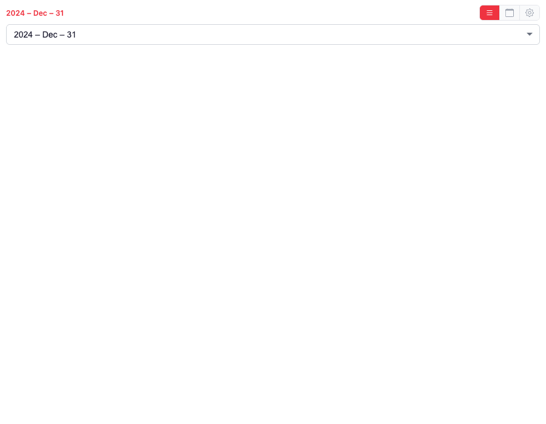

# Date Selector — Setup Guide

Drop-in date control that replaces Domo's native date filter and emits a
**page filter** (`domo.filterContainer`) on the picked column. Cards on
the same page filtered by that column refresh automatically. No App
Studio variable wiring required (v1.3 dropped the variable path).

---

## What it does

- Renders a calendar (or dropdown list) showing **only the dates present in
  the bound dataset** — empty days greyed out.
- When a user picks a date, the brick emits `domo.filterContainer(...)`
  with a page filter on the configured column. Any card on the page that
  filters by that column refreshes.
- Configuration is **per-card** and **persists** in an AppDB collection.
  Admin sets it once; end users see only the calendar.

---

## 0. Prereqs

- App design **Date Selector** already exists in your tenant (id
  `4896fd53-0232-42d3-b31b-7be12b50e6ed`). If not, upload
  `date-selector-1.3.0.zip` via Asset Library → Apps → ⋮ → Upload Design.
- Dataset bound with a date-typed column (literal column name; admin
  picks it in the gear panel).
- At least one downstream card on the page that filters by that same
  column (dataset-level filter, not a variable).

---

## 1. Add the card to an App Studio page

1. App Studio → open the page (Edit mode).
2. **+ Card** → **Custom App** → search **Date Selector**.
3. Place the card; minimum useful size 2×1.
4. **Domo will prompt for the dataset** as part of adding the card —
   the right-hand panel shows a dataset picker.
   - Pick the dataset whose dates you want surfaced. Required column:
     `Date` (literal name, case-sensitive).
   - This wires up the brick's `sampleData` alias. You won't see the
     word "bind" — it just looks like picking a data source. That's it.
5. If a second alias `variablesDataSet` is shown, **skip it** (leave
   unbound). Auto-detect handles single-variable cases without it. It's
   only useful for advanced multi-app registries.

---

## 2. Pick the filter column (admin, one-time)

> **Who sees the gear?** Only users with a Domo system role of `Admin` or
> `Privileged`, OR the owner of the App Studio app, can see the gear icon
> in v1.2+. End users see only the dropdown/calendar. If the Code Engine
> package `Domo AppStudio Pages` is not provisioned on your instance, the
> gear stays visible to everyone (fail-open so config is never locked).

1. Click the brick's **gear ⚙** (top-right of the card). Admin-only.
2. Settings panel opens. The first section is **Filter Configuration**.

3. **Filter column** — dropdown listing every column of the bound
   dataset (discovered via `SELECT * ... LIMIT 1` and cached 30 min).
   Pick the date column your downstream cards filter by.
4. **Filter operator** — default `EQUALS` for a single-day filter.
   Other options: `BETWEEN` (range), `LESS_THAN_EQUALS_TO`
   (cumulative-through), `GREAT_THAN_EQUALS_TO` (from-date).
5. **Data type** — default `DATE`. Change to `STRING` or `NUMERIC` only
   if the column is not date-typed.
6. Selection auto-saves to the brick's AppDB collection
   (`date-selector-settings`). Panel can be closed.
7. Verify the status line at the bottom:
   `Admin · Card <id> · filter=<column> <op>`

> **Persistence:** in v1.2+, every card-instance keeps its own
> configuration (variable name, view mode, date format) keyed by the
> Domo card id. Two cards on the same page can drive different variables
> or display different date formats without overwriting each other.
> Refresh the page, sign out, switch devices — config follows the card.

---

## 3. End-user behaviour

- **Calendar view (default)** — months side-by-side; only in-dataset days
  are clickable. Headers render as `2026 – Sep` (YYYY – MMM). Picked
  date highlighted; selected label shown in the toolbar.

  

- **List view (≡ icon)** — dropdown listing every available date,
  descending (latest first), formatted `YYYY – MMM – DD`.

  

- Picking a date emits a `filterContainer` page filter on the configured
  column with the ISO date value. Filtered cards re-render.

---

## 4. Re-configure or clear

- **Change the filter column / operator:** gear ⚙ → pick a different
  value → auto-saves.
- **Wipe configuration:** gear ⚙ → **Reset**. Both the config doc and
  any persisted picked date are deleted from AppDB.

---

## 5. Sandbox / security notes

- The brick lives inside Domo's standard custom-app iframe sandbox.
- Filter emission uses Domo's documented `domo.filterContainer` API —
  no DOM scraping, no private REST endpoints.
- Column discovery reads a single row of the bound dataset via the
  documented `POST /sql/v1/<alias>` SQL endpoint.

---

## Troubleshooting

| Symptom | Likely cause | Fix |
|---|---|---|
| Every day greyed out | `Date` column missing or differently named | Confirm bound dataset has a literal `Date` column. Re-bind. |
| Picking a date doesn't filter | No filter column selected in gear panel | Open gear → pick a column → auto-saves. |
| Cards don't respond | Downstream card filters by a different column | Match the column names, or pick that column in the gear. |
| Column dropdown empty | Dataset schema fetch failed | Confirm alias `sampleData` bound. Fallback text input lets you type the column name. |
| Dropdown sort order wrong | You're on a pre-1.0.3 version | Upload the latest zip via Asset Library. |
| Want to wipe config | Bad setup, starting over | Gear → Reset. |

---

## What's NOT in this release (v1.3.0)

- **Between (date range) mode** — code paths preserved; UI hidden pending
  stakeholder use-case confirmation. Flip `HIDE_BETWEEN` to re-enable.
- **Multi-column filter emission** — one column per card. Add a second
  card if you need multiple columns filtered.
- **Variable emission** — dropped entirely in v1.3. Beast modes that
  referenced App Studio variables must be rebuilt to filter by the raw
  dataset column instead.

---

## Support

Open an issue in this repository for support.
