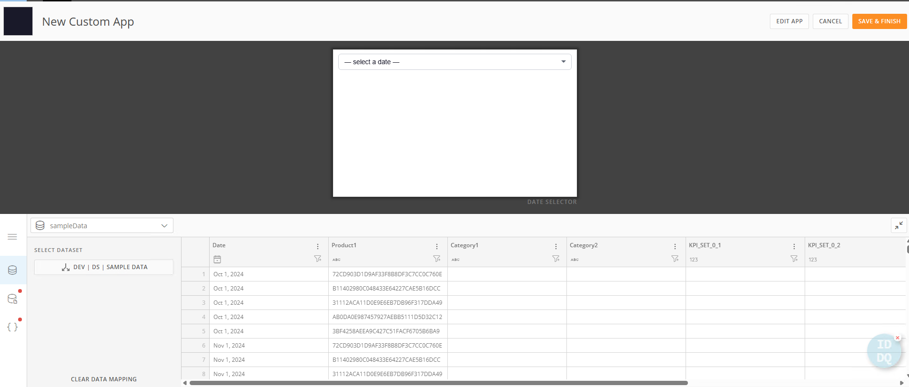
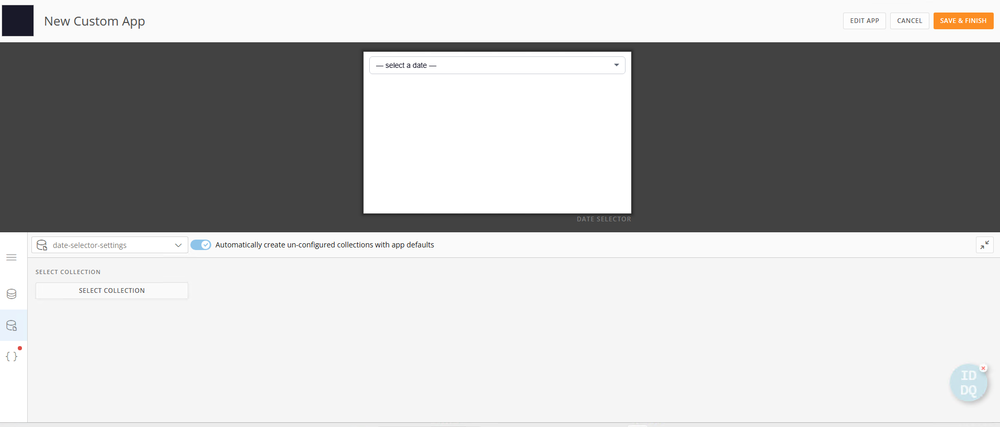
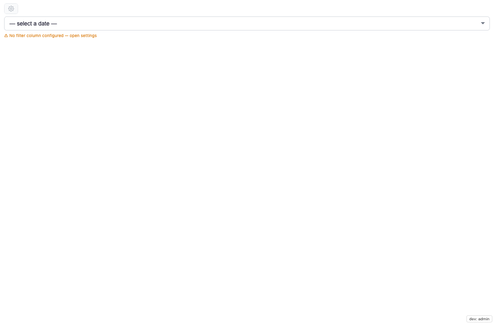
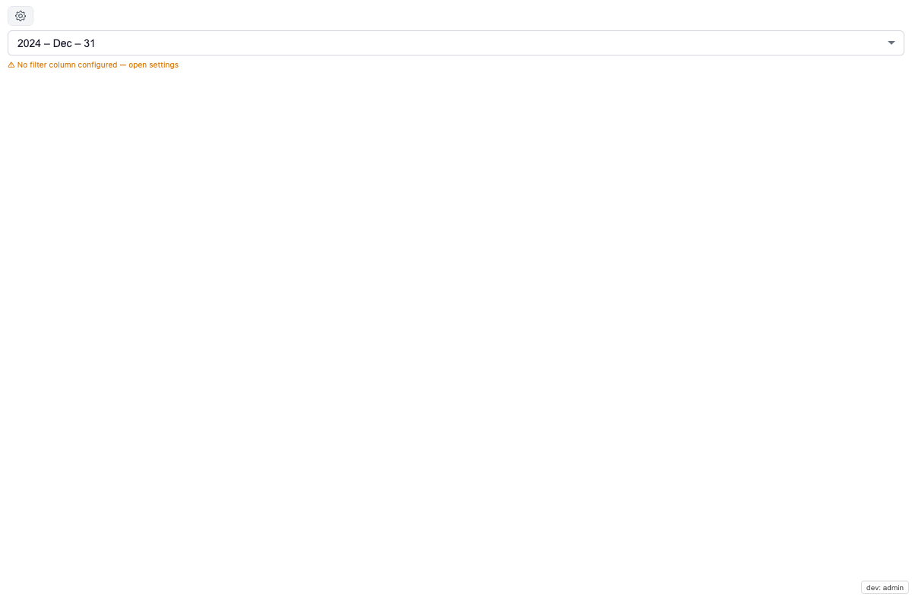
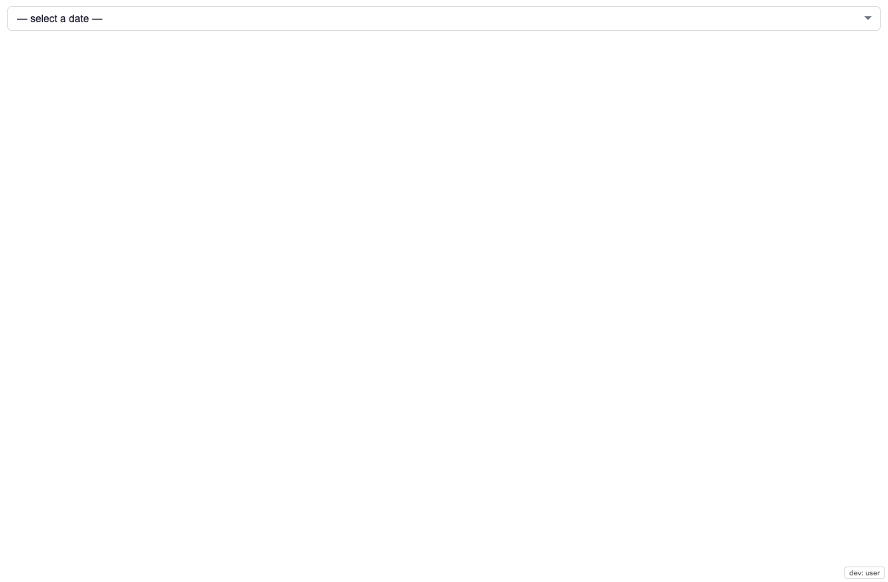

# Date Selector — Setup Guide

Drop-in date control that shows **only the dates present in the bound
dataset** and, on selection, **drives an App Studio variable** (primary)
and/or **emits a page filter** (optional). Cards that read that variable
in a Beast Mode — or filter by the picked column — refresh automatically.

**Current release: v1.4.0** — variable-drive is the primary path;
page filter is optional; editable custom date formats persist in a
shared collection.

> **⚠ Most important setup step:** for the variable path to work, the
> target variable **must have a page-level Variable Control on the App
> Studio page**. A custom-app card can only drive a variable that the
> page already exposes via a control. No control → the value is
> accepted but never reaches the cards. See **Section 3** below.

---

## What it does

- Renders a dropdown (or calendar) showing **only the dates present in
  the bound dataset** — empty days greyed out.
- On date pick, the brick:
  - **Drives an App Studio variable** by name (e.g. `vMonthStart_test`)
    with a computed value (picked date, start-of-month, FY-start, …).
    Beast modes referencing that variable recompute — Monthly, YTD,
    YoY, etc. **(primary path)**
  - Optionally **emits a page filter** (`domo.filterContainer`) on a
    dataset column, for cards filtered by that column directly.
- Configuration is **per-card** and **persists** in an AppDB collection.
  Admin sets it once; end users see only the dropdown.

---

## 0. Prereqs

- App design **Date Selector** exists in your tenant (id
  `4896fd53-0232-42d3-b31b-7be12b50e6ed`). If not, upload
  `date-selector-1.4.0.zip` via Asset Library → Apps → ⋮ → Upload Design.
- Dataset bound with a date-typed column.
- **For the variable path (recommended):**
  - An App Studio **Variable** used by your Beast Modes (e.g.
    `vMonthStart_test`).
  - A **Variable Control for that variable on the page** (Section 3).
- **For the page-filter path (optional):** at least one downstream card
  that filters by the picked dataset column.

---

## 1. Create the card + wire the dataset

Card creation happens in Domo's **New Custom App** wiring screen —
BEFORE the card is added to any App Studio page. This is where the
dataset alias and the AppDB collection get bound to this specific
card instance.

1. From your Domo instance, create a new card from the **Date
   Selector** design (Asset Library → the design → **Add to Domo** /
   **Create Card**). The New Custom App wiring screen opens with the
   preview at the top and a data-mapping panel at the bottom.
2. The left rail shows three wiring tabs — dataset, collection, and
   packages (Code Engine). Work top-down.

### 1a. Wire the dataset (alias `sampleData`)



- **Left rail** → dataset icon (top). The alias `sampleData` (from
  the manifest) is preselected.
- Click **SELECT DATASET** and pick the dataset whose date column
  your downstream cards filter by. Any dataset with at least one
  date-typed column works — the actual column name is arbitrary
  (you'll pick it in step 3).
- The column preview to the right confirms the bound schema
  (`Date`, `Product1`, `Category1`, …). The brick reads this same
  schema at runtime to populate the Filter column dropdown.

### 1b. Wire the collection (`date-selector-settings`)



- **Left rail** → collection icon (middle).
- Leave **"Automatically create un-configured collections with app
  defaults"** turned ON (default). Domo provisions the collection
  the first time the card runs.
- If the toggle is off, click **SELECT COLLECTION** and either pick
  an existing `date-selector-settings` collection or let the app
  create one.
- No manual schema entry — the manifest declares every column
  (`type`, `cardId`, `mode`, `viewMode`, `dateFormat`,
  `filterColumn`, `filterOperator`, `filterDataType`, `pattern`,
  `label`, plus state fields).

### 1c. Packages (Code Engine)

- **Left rail** → third icon (packages). Leave defaults if the
  `Domo AppStudio Pages` package is already provisioned on your
  instance (it powers admin/owner gating). If not provisioned, the
  gear stays visible to everyone (fail-open).

### 1d. Save

Click **SAVE & FINISH** (top right). Card is now created with
sampleData bound and the collection auto-provisioned.

> **Second-card note:** each new card created from this design gets
> its own dataset binding + its own `cardId`-scoped config in the
> shared collection. Two cards can bind different datasets on
> different pages. Custom date formats (see step 4) are shared
> globally across every card instance on this design.

---

## 2. Add the card to an App Studio page



1. Open the target App Studio page in Edit mode.
2. **+ Card** → search the card name you just created (or drag from
   the **My Cards** panel).
3. **Place** on the canvas. Minimum useful size **2×1**. Larger sizes
   are fine — the dropdown centres regardless of card dimensions.
4. Save the page. Card renders a "⚠ Nothing configured" note until you
   finish Section 3.

---

## 3. Add a page Variable Control (REQUIRED for the variable path)

> **This is the step everyone misses.** A custom-app card cannot drive
> an App Studio variable unless that variable has a **Variable Control
> on the page**. Without it, the brick's update is accepted (you'll even
> see a `✓ ack` in the console) but the value never reaches the Beast
> Mode cards — they stay frozen on the variable default.

1. Open the App Studio page in **Edit** mode.
2. From the **right-side rail**, drag a **Control** onto the page (the
   sliders / controls icon).
3. Click **Add** → select your variable (e.g. `vMonthStart_test`) from
   the list.
4. Save. The control now exists on the page — it can be shrunk or tucked
   out of the way; the brick is the real UI. It only has to *exist* so
   App Studio registers the variable as driveable on this page.

> **Why:** App Studio only propagates a variable's value to the page's
> cards through a page-level Variable Control. The brick pushes the value
> by name; the control is what routes it to every Beast Mode that uses
> the variable.

---

## 4. Configure the brick (admin, one-time)

> **Who sees the gear?** Only users with a Domo system role of `Admin`
> or `Privileged`, OR the owner of the App Studio app. End users see
> only the dropdown. If the Code Engine package `Domo AppStudio Pages`
> is not provisioned on your instance, the gear stays visible to
> everyone (fail-open — config is never locked out).

1. Click the brick's **gear ⚙** (top-right of the card).
2. **Date Selector Settings** panel opens.



### 4a. Drive App Studio variable (primary)

- In **Drive App Studio variable**, type the exact variable name
  (e.g. `vMonthStart_test`). Case-sensitive. Autocomplete lists any
  variables App Studio has pushed to the card.
- **Push what value?** choose the formula sent on each pick:

  | Option | Sends |
  |---|---|
  | Picked date | the exact date picked |
  | Start of picked month | 1st of the picked month (e.g. drives `vMonthStart_test`) |
  | End of picked month | last day of the picked month |
  | Start of calendar year | Jan 1 of the picked year |
  | Start of financial year | 1st of the FY containing the picked date (set FY month) |
  | End of financial year | last day of that FY |

- The value is pushed as an ISO `YYYY-MM-DD` string, which Beast modes
  compare against the date column.

### 4b. Page filter (optional)

- Expand **Page filter (optional)** only if some cards filter by a
  dataset column directly (no variable). Leave the column on **— none —**
  to skip.
- When a column is chosen, pick an **operator** (`EQUALS`,
  `LESS_THAN_EQUALS_TO`, `GREAT_THAN_EQUALS_TO`, `BETWEEN`, or a computed
  range `MTD` / `CYTD` / `FYTD`) and a **data type** (default `DATE`).

### 4c. Save

Every control auto-saves to the card's AppDB config doc. Status line at
the bottom confirms:

```
Admin · Card <8-char-id> · var=<variable> · filter=<column> <operator>
```

Close the gear. Pick a date — cards driven by the variable (and/or the
page filter) refresh.

---

## 5. Pick a date format (admin, one-time)

Still in the gear panel, scroll to **Date format**.

- **Built-in** presets: `YYYY – MMM – DD`, `YYYY – MMM`, `YYYY-MM-DD`.
- **Custom** entries: use the "Add custom format" section at the
  bottom of the Date format group.

### Adding a custom format

1. Type a **date-fns pattern** in the first input. Common tokens:
   - `yyyy` — 4-digit year
   - `MM` / `MMM` / `MMMM` — month (`07` / `Jul` / `July`)
   - `dd` / `d` — day of month (`02` / `2`)
   - `EEEE` — weekday (`Thursday`)
   - Literal characters inside single quotes, e.g.
     `yyyy ' – ' MMM ' – ' dd` renders `2026 – Jul – 02`.
2. Optional: type a **label** shown in the dropdown (falls back to the
   pattern itself if blank).
3. Live preview renders as you type. Invalid patterns show a red
   error.
4. Click **Add + Use**. The new pattern is saved to the collection as
   a `type:'format'` doc (NO `cardId` — shared globally across every
   card instance on this design) and auto-selected for the current
   card.

### Deleting a custom format

Click the × next to any custom entry. Removes the global doc. Any
card currently using that pattern falls back to the default preset.

---

## 6. Verify



1. Refresh the App Studio page.
2. As a non-admin user (or with dev role toggle off in local dev):
   confirm only the dropdown renders — no gear, no toolbar.
3. Pick a date. Cards driven by the variable (and/or the page filter)
   recompute.
4. **Variable path check:** open DevTools → **Console**. A pick logs
   `[emitVariable] …` (dev build) and the Beast Mode cards change. If
   the console shows a `✓ ack` but the cards *don't* move, the page is
   **missing the Variable Control** — go back to Section 3.
5. Refresh the page. The brick rehydrates the last picked date and
   re-drives the variable / re-emits the filter automatically.

> **Persistence:** every card-instance keeps its own config (variable,
> value formula, filter, view mode, date format) keyed by the Domo card
> id. Two cards on the same page hold independent settings. Custom date
> formats persist globally so every future card instance pulls the same
> format list.

---

## 7. End-user behaviour

- Default surface for everyone: a **dropdown** listing every date
  present in the bound dataset, sorted descending (latest first),
  formatted per the chosen date format.
- Non-admin users never see the gear or any toolbar chrome — pure
  dropdown.
- Picking a date drives the configured variable (and/or emits the page
  filter). Cards refresh.
- Admins can flip **Default view** to `Calendar` in the gear if a
  calendar grid is preferred over the dropdown.

---

## 8. Re-configure or clear

- **Change variable / value formula / filter / date format:** gear ⚙ →
  pick a different value → auto-saves.
- **Wipe card config:** gear ⚙ → **Reset**. Deletes the card's config
  and state docs from AppDB. Global custom date formats are NOT
  affected (delete those individually via the × next to each entry).

---

## 9. Sandbox / security notes

- The brick lives inside Domo's standard custom-app iframe sandbox.
- Variable drive uses the documented `domo.requestVariablesUpdate` API;
  page-filter emission uses `domo.filterContainer` — no DOM scraping,
  no private REST endpoints.
- Column discovery reads a single row of the bound dataset via the
  documented `POST /sql/v1/<alias>` SQL endpoint.

---

## Troubleshooting

| Symptom | Likely cause | Fix |
|---|---|---|
| **Variable cards frozen; console shows `✓ ack`** | **No page-level Variable Control for the variable** | **Add a Variable Control for the variable to the page (Section 3). This is the #1 cause.** |
| Variable cards still frozen after adding control | Variable name typo (case-sensitive) or wrong value formula | Re-check the exact name; set the right "Push what value" (e.g. Start of picked month). |
| Monthly / MTD reads 0 but YTD works | Value formula sends a day the monthly Beast Mode's `Date = var` never matches | Set **Push value → Start of picked month** if rows are month-start dated. |
| Every day greyed out | Date column missing or differently named | Confirm the bound dataset has the expected date column. Re-bind. |
| Page-filter cards don't respond | Downstream card filters by a different column | Match column names, or pick that column under Page filter (optional). |
| Column dropdown empty | Dataset schema fetch failed | Confirm the dataset alias `sampleData` is bound. |
| Want to wipe config | Bad setup, starting over | Gear → Reset. |

---

## What's NOT in this release (v1.4.0)

- **Between (date range) mode** — code paths preserved; UI hidden pending
  stakeholder confirmation. Flip `HIDE_BETWEEN` to re-enable.
- **Multi-variable / multi-column emission** — one variable + one
  optional filter column per card. Add a second card for more.
- **Auto-discovery of the variable functionId** — not needed. The brick
  drives the variable by name once the page Variable Control exists.

---

## Support

Open an issue in this repository for support.
