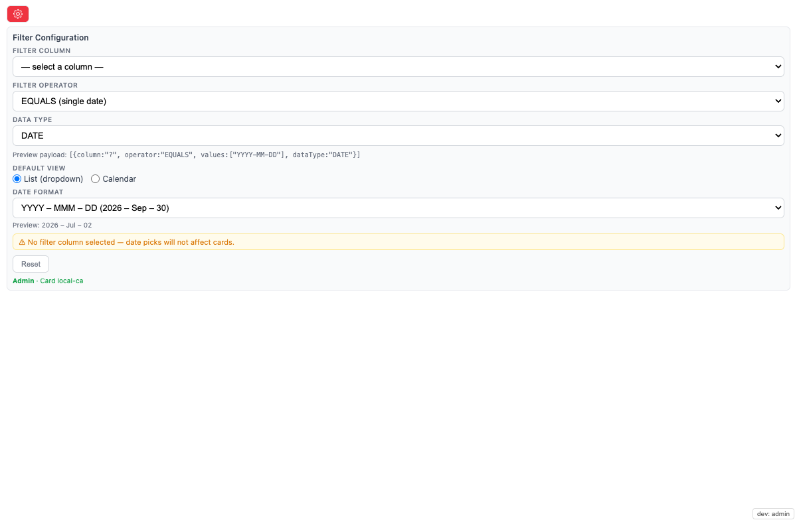

# Date Selector — Setup Guide

Drop-in date control that replaces Domo's native date filter and emits a
**page filter** (`domo.filterContainer`) on the picked column. Cards on
the same page filtered by that column refresh automatically. No App
Studio variable wiring required.

**Current release: v1.3.1** — editable custom date formats persisted
in a shared collection, so every future card instance pulls from the
same format list.

---

## What it does

- Renders a calendar (or dropdown list) showing **only the dates present in
  the bound dataset** — empty days greyed out.
- When a user picks a date, the brick emits `domo.filterContainer(...)`
  with a page filter on the configured column. Any card on the page that
  filters by that column refreshes.
- Configuration is **per-card** and **persists** in an AppDB collection.
  Admin sets it once; end users see only the calendar.


---

## 0. Prereqs

- App design **Date Selector** already exists in your tenant (id
  `4896fd53-0232-42d3-b31b-7be12b50e6ed`). If not, upload
  `date-selector-1.3.1.zip` via Asset Library → Apps → ⋮ → Upload Design.
- Dataset bound with a date-typed column (literal column name; admin
  picks it in the gear panel).
- At least one downstream card on the page that filters by that same
  column (dataset-level filter, not a variable).

---

## 1. Add the card to an App Studio page


1. **Open the App Studio page** you want to filter (Edit mode).
2. Click **+ Card** → **Custom App** → search **Date Selector** →
   select it.
3. **Place the card** on the canvas. Minimum useful size **2×1**.
   Larger sizes are fine — the dropdown centres regardless of card
   dimensions.
4. Save the page. The card renders "⚠ No filter column configured —
   open settings" until step 3 below.

> **Second-brick warning:** you can add multiple Date Selector cards to
> the same page — each keeps independent settings (per-card `cardId`
> discriminator in AppDB). Custom date-format entries are shared across
> all card instances on this design.

---

## 2. Bind the dataset at the card level

The brick reads dates and column schema from a single bound dataset
(alias `sampleData` in the manifest).

1. In App Studio, click the Date Selector card to select it.
2. Open the right-hand **Data** panel (or hover the card → **Change
   dataset**).
3. Pick the dataset whose date column your downstream cards filter by.
   - The dataset must have at least one **date-typed column** (the
     column name is arbitrary; you'll pick it in step 3).
   - No other alias is required. Earlier versions had a
     `variablesDataSet` slot — that was removed in v1.3.
4. Save. The brick immediately re-fetches the schema and populates the
   Filter column dropdown in the gear panel.

> **Dataset scope:** each Date Selector card can bind a different
> dataset. Two cards on the same page can drive filters on entirely
> different datasets simultaneously — for example one card for
> `sales_daily.Date` and another for `traffic.EventDate`.

---

## 3. Configure the filter (admin, one-time)

> **Who sees the gear?** Only users with a Domo system role of `Admin`
> or `Privileged`, OR the owner of the App Studio app. End users see
> only the dropdown. If the Code Engine package `Domo AppStudio Pages`
> is not provisioned on your instance, the gear stays visible to
> everyone (fail-open — config is never locked out).

1. Click the brick's **gear ⚙** (top-right of the card).
2. **Filter Configuration** panel opens.



### 3a. Pick the filter column

- **Filter column** dropdown lists every column of the bound dataset
  (discovered via `SELECT * FROM <alias> LIMIT 1`, cached 30 min in
  `localStorage`).
- Pick **the same column** that your downstream cards filter by. For
  most cases this is the dataset's date column (e.g. `Date`,
  `TransactionDate`, `EventDate`).
- The column name is case-sensitive. If your downstream card filters
  by `Date` but you pick `date` here, the filter payload will not
  match.

### 3b. Pick the filter operator

| Operator | When to use |
|---|---|
| `EQUALS` | Single-day filter. Downstream shows only rows exactly on the picked date. Default. |
| `LESS_THAN_EQUALS_TO` | "Through" date — MTD / YTD / cumulative-through. Downstream shows every row up to and including the picked date. |
| `GREAT_THAN_EQUALS_TO` | "From" date — everything on or after the picked date. |
| `BETWEEN` | Range mode (Between UI currently hidden — code path preserved). |

### 3c. Data type

Default `DATE`. Only change to `STRING` or `NUMERIC` if the column
is not date-typed (unusual for this brick's use case).

### 3d. Save

Every control auto-saves to the card's AppDB config doc. Status line
at the bottom of the panel confirms:

```
Admin · Card <8-char-id> · filter=<column> <operator>
```

Close the gear. The dropdown is now live — pick a date and downstream
cards refresh.

---

## 4. Pick a date format (admin, one-time)

Still in the gear panel, scroll to **Date format**.

- **Built-in** presets: `YYYY – MMM – DD`, `YYYY – MMM`, `YYYY-MM-DD`.
- **Custom** entries: use the "Add custom format" section at the
  bottom of the Date format group.

### Adding a custom format

1. Type a **date-fns pattern** in the first input. Common tokens:
   - `yyyy` — 4-digit year
   - `MM` / `MMM` / `MMMM` — month (`07` / `Jul` / `July`)
   - `dd` / `d` — day of month (`02` / `2`)
   - `EEEE` — weekday (`Thursday`)
   - Literal characters inside single quotes, e.g.
     `yyyy ' – ' MMM ' – ' dd` renders `2026 – Jul – 02`.
2. Optional: type a **label** shown in the dropdown (falls back to the
   pattern itself if blank).
3. Live preview renders as you type. Invalid patterns show a red
   error.
4. Click **Add + Use**. The new pattern is saved to the collection as
   a `type:'format'` doc (NO `cardId` — shared globally across every
   card instance on this design) and auto-selected for the current
   card.

### Deleting a custom format

Click the × next to any custom entry. Removes the global doc. Any
card currently using that pattern falls back to the default preset.

---

## 5. Verify


1. Refresh the App Studio page.
2. As a non-admin user (or with dev role toggle off in local dev):
   confirm only the dropdown renders — no gear, no toolbar.
3. Pick a date. Downstream cards on the page filtered by the same
   column refresh.
4. In DevTools Network / iframe protocol tab, confirm a
   `filterContainer` message with payload
   `[{column, operator, values, dataType}]`.
5. Refresh the page. The brick rehydrates the last picked date and
   re-emits the filter automatically.

> **Persistence:** every card-instance keeps its own config (filter
> column, operator, view mode, date format) keyed by the Domo card id.
> Two cards on the same page hold independent settings. Custom date
> formats persist globally so every future card instance pulls the
> same format list.

---

## 6. End-user behaviour

- Default surface for everyone: a **dropdown** listing every date
  present in the bound dataset, sorted descending (latest first),
  formatted per the chosen date format.
- Non-admin users never see the gear or any toolbar chrome — pure
  dropdown.
- Picking a date emits a `filterContainer` page filter on the
  configured column with the ISO date value. Downstream cards
  refresh.
- Admins can flip **Default view** to `Calendar` in the gear if a
  calendar grid is preferred over the dropdown (calendar shows only
  in-dataset days as clickable; empty days greyed out).

---

## 7. Re-configure or clear

- **Change filter column / operator / date format:** gear ⚙ → pick a
  different value → auto-saves.
- **Wipe card config:** gear ⚙ → **Reset**. Deletes the card's config
  and state docs from AppDB. Global custom date formats are NOT
  affected (delete those individually via the × next to each entry).

---

## 8. Sandbox / security notes

- The brick lives inside Domo's standard custom-app iframe sandbox.
- Filter emission uses Domo's documented `domo.filterContainer` API —
  no DOM scraping, no private REST endpoints.
- Column discovery reads a single row of the bound dataset via the
  documented `POST /sql/v1/<alias>` SQL endpoint.

---

## Troubleshooting

| Symptom | Likely cause | Fix |
|---|---|---|
| Every day greyed out | `Date` column missing or differently named | Confirm bound dataset has a literal `Date` column. Re-bind. |
| Picking a date doesn't filter | No filter column selected in gear panel | Open gear → pick a column → auto-saves. |
| Cards don't respond | Downstream card filters by a different column | Match the column names, or pick that column in the gear. |
| Column dropdown empty | Dataset schema fetch failed | Confirm alias `sampleData` bound. Fallback text input lets you type the column name. |
| Dropdown sort order wrong | You're on a pre-1.0.3 version | Upload the latest zip via Asset Library. |
| Want to wipe config | Bad setup, starting over | Gear → Reset. |

---

## What's NOT in this release (v1.3.1)

- **Between (date range) mode** — code paths preserved; UI hidden pending
  stakeholder use-case confirmation. Flip `HIDE_BETWEEN` to re-enable.
- **Multi-column filter emission** — one column per card. Add a second
  card if you need multiple columns filtered.
- **Variable emission** — dropped entirely in v1.3. Beast modes that
  referenced App Studio variables must be rebuilt to filter by the raw
  dataset column instead.

---

## Support

Open an issue in this repository for support.
